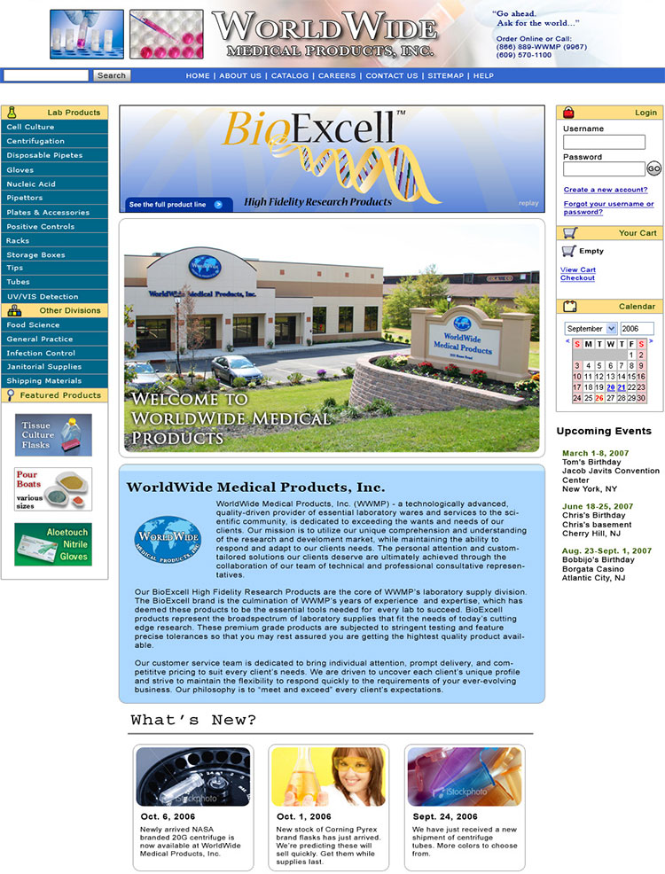
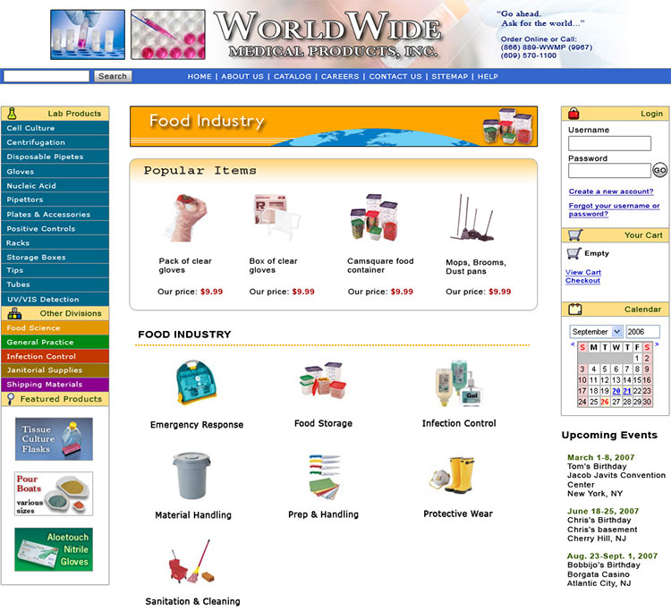
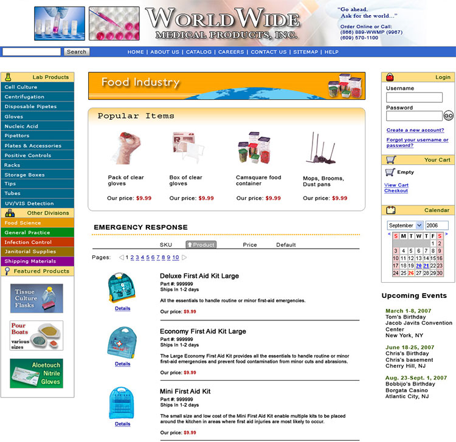
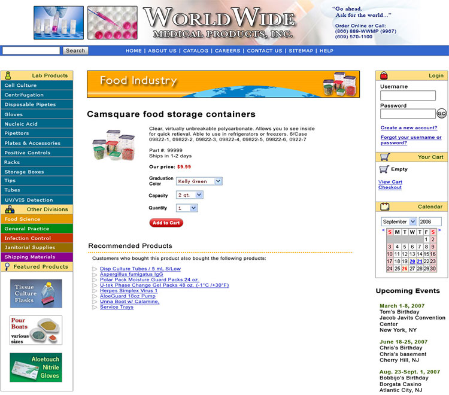

  
`wwmponline.com`  

# Dates:  
2005 - 2008  
# Technologies:  
Photoshop, Dreamweaver, HTML4, CSS2, Flash, PHP (Smarty Template), MySQL
# Description:  
This website was created to initially sell medical and laboratory products and equipment as well as other miscellaneous items online.  Later on they paired down their inventory to focus more on medical and laboratory items only.   

I oversaw the full development cycle of this project from design, coding, to maintenance.  
This was my first experience building an ecommerce website.  I used a software shopping cart system called [X-Cart - http://www.x-cart.com](http://www.x-cart.com) which I had to learn, install, configure and customize to the company's needs.  The X-Cart software ran in a version of PHP called Smarty templates.  
# Screenshots:
  

  

  

  
